# 无人健身房管理系统 - PlantUML Salt 原型界面图

## 1. 登录页面原型图

```plantuml
@startsalt
{
  {+ 渐变背景
    {* 🏋️ 健身房管理系统
      欢迎回来，请登录您的账户
    }
    
    {
      [👤 用户登录 | 🔑 管理员登录 ]
    }
    
    {SI
      用户名
      [                    ]
      密码
      [                    ]
    }
    
    [     登 录     ]
    
    还没有账户？[立即注册]
  }
}

@startsalt
{
  {+ 模态框背景
    {
      {* ⚠️ 订单已逾期 }
      您的会员订单已过期
      需要续费后才能继续使用服务
      --
      [退出登录] [去续费]
    }
  }
}
@endsalt
```

## 2. 注册页面原型图

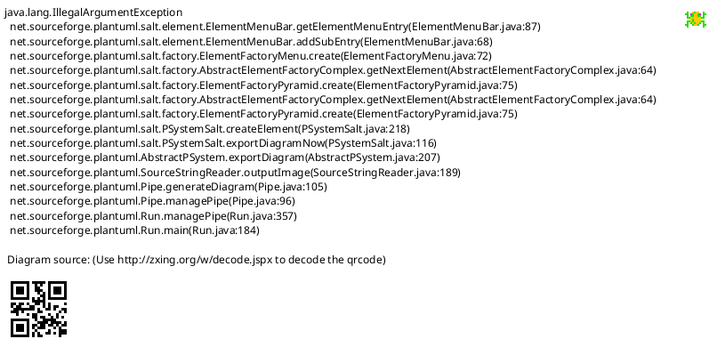

## 3. 用户仪表盘 - 个人信息页面原型图

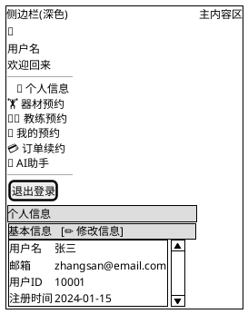

## 4. 用户仪表盘 - 器材预约页面原型图

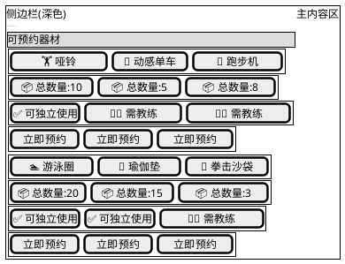

## 5. 用户仪表盘 - 教练预约页面原型图

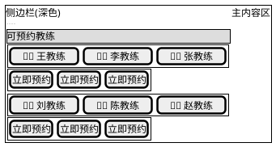

## 6. 用户仪表盘 - 我的预约页面原型图

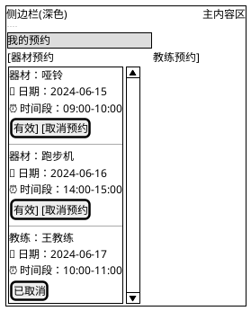

## 7. 用户仪表盘 - AI助手页面原型图

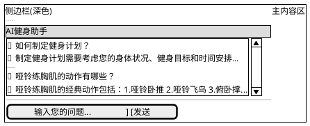

## 8. 管理员仪表盘 - 数据大屏页面原型图

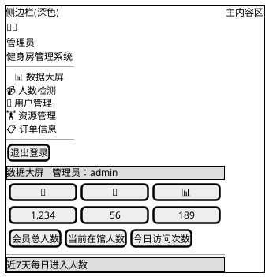

## 9. 管理员仪表盘 - 人数检测页面原型图

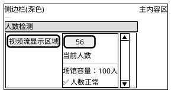

## 10. 管理员仪表盘 - 用户管理页面原型图

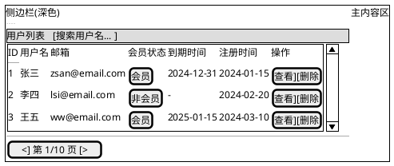

## 11. 管理员仪表盘 - 资源管理页面原型图

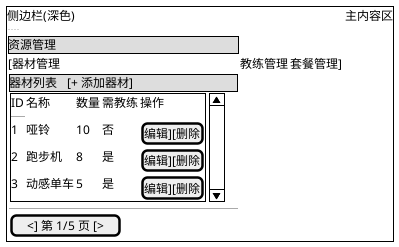

## 12. 预约弹窗原型图

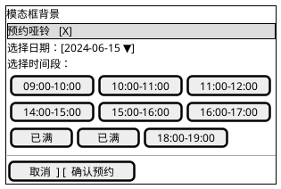

---

## 如何使用这些原型图

### 在线渲染
1. 访问 [PlantUML Online Server](http://www.plantuml.com/plantuml/)
2. 复制上述代码粘贴到编辑框
3. 点击 Submit 查看渲染结果

### VS Code 插件
1. 安装 PlantUML 插件
2. 安装 Graphviz（用于渲染图表）
3. 新建 `.puml` 文件，粘贴代码
4. 使用快捷键 `Alt+D` 预览

### 本地渲染
```bash
# 安装 PlantUML
java -jar plantuml.jar 原型界面-PlantUML-Salt.md
```

## Salt 语法说明

- `{+ ... }`：带边框的容器
- `{* ... }`：标题/强调文本
- `{T ... }`：树形菜单
- `{SI ... }`：简单表格/信息列表
- `[按钮文字]`：按钮
- `[输入框      ]`：输入框
- `--`：分隔线
- `|`：列分隔符
- `{ ... | ... }`：横向排列
- `{ ... { ... } }`：嵌套布局
