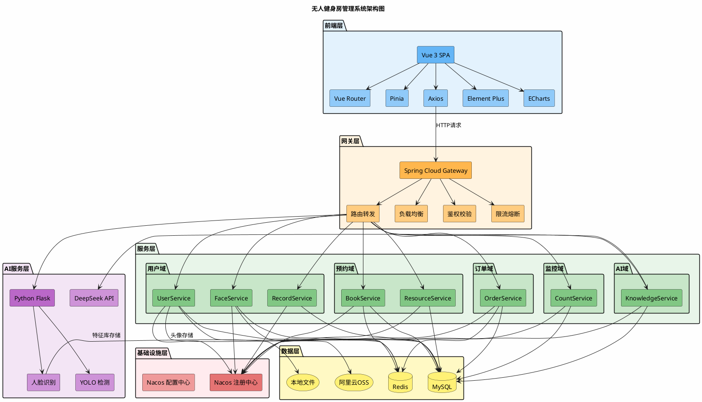

# 无人健身房管理系统 - 开发环境与技术选型

## 1. 开发环境

### 1.1 硬件环境

| 设备类型 | 配置要求 |
|---------|---------|
| **开发服务器** | CPU: Intel i5 或更高，内存: 16GB+，硬盘: 256GB SSD |
| **测试服务器** | CPU: Intel i5 或更高，内存: 8GB+，硬盘: 128GB SSD |
| **客户端** | 支持现代浏览器的PC、平板、手机设备 |
| **摄像头** | USB摄像头或网络摄像头（用于人脸识别） |

### 1.2 软件环境

| 软件 | 版本 | 用途 |
|-----|------|-----|
| **操作系统** | Windows 10/11 或 Linux (Ubuntu 20.04+) | 开发和部署环境 |
| **JDK** | 17+ | Java运行环境 |
| **Maven** | 3.8+ | Java项目构建工具 |
| **Node.js** | 20.19.0+ 或 >=22.12.0 | 前端开发环境 |
| **Python** | 3.11+ | AI服务和人脸识别服务 |
| **MySQL** | 8.0+ | 关系型数据库 |
| **Redis** | 6.0+ | 内存缓存数据库 |
| **Nacos** | 2.2+ | 服务注册与配置中心 |
| **IntelliJ IDEA** | 2023+ | Java开发IDE |
| **VS Code** | 最新版 | 前端和Python开发 |

---

## 2. 技术选型

### 2.1 后端技术栈

| 技术 | 版本 | 用途说明 |
|-----|------|---------|
| **Spring Boot** | 3.3.4 | 基础开发框架，提供自动配置和嵌入式服务器 |
| **Spring Cloud** | 2023.0.3 | 微服务架构支持 |
| **Spring Cloud Alibaba** | 2023.0.3.2 | 阿里微服务组件，提供服务治理和配置管理 |
| **Spring Cloud Gateway** | - | 网关服务，统一入口、路由转发、负载均衡 |
| **Nacos** | 2.2+ | 服务注册与发现、配置中心 |
| **MyBatis Plus** | 3.5.6+ | ORM框架，简化数据库操作 |
| **MySQL** | 8.0+ | 主数据库，存储业务数据 |
| **Redis** | 6.0+ | 缓存数据库，提升查询性能 |
| **JWT** | - | 无状态身份认证 |
| **Maven** | 3.8+ | 项目构建和依赖管理 |
| **Lombok** | - | 简化Java代码，自动生成Getter/Setter等 |

#### 微服务拆分

| 服务名称 | 端口 | 功能说明 |
|---------|------|---------|
| **Gateway** | 80 | 网关服务，统一API入口 |
| **UserService** | 动态 | 用户管理服务 |
| **FaceService** | 动态 | 人脸识别服务 |
| **CountService** | 动态 | 人数检测服务 |
| **RecordService** | 动态 | 出入记录服务 |
| **KnowledgeService** | 动态 | AI知识库服务 |
| **ResourceService** | 动态 | 资源管理服务（器材、教练） |
| **BookService** | 动态 | 预约管理服务 |
| **OrderService** | 动态 | 订单管理服务 |

### 2.2 前端技术栈

| 技术 | 版本 | 用途说明 |
|-----|------|---------|
| **Vue 3** | 3.5.32 | 前端渐进式框架，组合式API |
| **Vite** | 8.0.8+ | 前端构建工具，快速热更新 |
| **TypeScript** | 6.0.0+ | 类型安全的JavaScript超集 |
| **Vue Router** | 5.0.4 | 前端路由管理 |
| **Pinia** | 3.0.4 | 状态管理库 |
| **Axios** | - | HTTP客户端，与后端通信 |
| **Element Plus** | - | UI组件库 |
| **ECharts** | - | 数据可视化图表库 |
| **ESLint** | 10.2.1+ | 代码规范检查 |
| **Prettier** | 3.8.3+ | 代码格式化 |

### 2.3 AI与算法技术栈

| 技术 | 版本 | 用途说明 |
|-----|------|---------|
| **Python** | 3.11+ | AI服务开发语言 |
| **OpenCV** | - | 计算机视觉库，图像处理 |
| **YOLO** | v5/v8 | 目标检测模型，用于人数检测 |
| **face_recognition** | - | 人脸识别库 |
| **NumPy** | - | 数值计算库 |
| **Flask** | - | Python Web框架，提供AI服务接口 |
| **DeepSeek API** | - | 大语言模型，AI问答服务 |
| **OpenAI SDK** | - | DeepSeek API调用客户端 |

### 2.4 中间件与工具

| 技术 | 版本 | 用途说明 |
|-----|------|---------|
| **MySQL** | 8.0+ | 关系型数据库，主数据存储 |
| **Redis** | 6.0+ | 内存数据库，缓存和会话存储 |
| **Nacos** | 2.2+ | 服务注册与发现、配置管理 |
| **Sentinel** | - | 流量控制、熔断降级（可选） |
| **Quartz** | - | 定时任务调度 |
| **Spring Mail** | - | 邮件发送服务 |
| **阿里云OSS** | - | 对象存储，存储用户头像等文件 |
| **WebSocket** | - | 实时通信，人数检测视频流推送 |

---

## 3. 技术选型理由

### 3.1 后端技术选型理由

**Spring Boot + Spring Cloud Alibaba**
- 成熟的微服务生态，社区活跃，文档丰富
- 支持服务注册发现、配置管理、网关路由等微服务核心能力
- 与Spring Boot无缝集成，开发效率高
- Nacos作为注册中心和配置中心，性能优秀，易于运维

**MyBatis Plus**
- 在MyBatis基础上增强，提供CRUD封装，减少重复代码
- 支持分页、性能分析、多租户等高级功能
- 与Spring Boot集成简单，学习成本低

**JWT认证**
- 无状态认证，适合微服务架构
- 无需服务端存储会话信息，易于水平扩展
- 跨域支持好，适合前后端分离架构

### 3.2 前端技术选型理由

**Vue 3 + Vite**
- Vue 3组合式API提供更灵活的代码组织方式
- Vite构建速度快，热更新即时，开发体验好
- 生态系统完善，周边工具链成熟

**TypeScript**
- 提供静态类型检查，减少运行时错误
- 更好的IDE支持，代码提示和重构能力强
- 提高代码可维护性，适合团队协作

**Pinia**
- Vue官方推荐的状态管理库
- API设计简洁，TypeScript支持好
- 模块化管理状态，易于维护

### 3.3 AI技术选型理由

**Python + OpenCV + YOLO**
- Python是AI领域的标准语言，生态丰富
- OpenCV提供完善的图像处理能力
- YOLO是实时目标检测的首选算法，速度快、准确率高

**DeepSeek API**
- 国产大模型，访问稳定
- 价格合理，提供免费额度
- 中文理解能力强，适合健身问答场景

---

## 4. 系统架构图



---

## 5. 技术架构特点

### 5.1 微服务架构优势

1. **独立部署**：各服务可独立开发、测试、部署，互不影响
2. **技术异构**：不同服务可采用最适合的技术栈（如AI服务使用Python）
3. **弹性伸缩**：根据负载情况独立扩展特定服务
4. **故障隔离**：单个服务故障不影响整个系统

### 5.2 前后端分离优势

1. **开发并行**：前后端可独立开发，提高开发效率
2. **多端适配**：同一套后端接口支持Web、App等多端
3. **用户体验**：SPA应用响应速度快，交互流畅
4. **易于维护**：前后端代码独立，职责清晰

### 5.3 AI能力集成

1. **人脸识别**：实现无感知签到，提升用户体验
2. **人数检测**：实时监控场馆人数，保障安全
3. **智能问答**：AI助手提供健身知识咨询服务

---

## 6. 部署架构建议

### 6.1 开发环境

```
┌─────────────────────────────────────────────────────────┐
│                     开发环境 (单机)                      │
├─────────────────────────────────────────────────────────┤
│  ┌──────────────┐                                       │
│  │   前端服务    │  npm run dev (Port 5173)             │
│  └──────────────┘                                       │
│  ┌──────────────┐  ┌──────────────┐  ┌──────────────┐  │
│  │  Gateway     │  │  Nacos       │  │  Python服务   │  │
│  │  (Port 80)   │  │  (Port 8848) │  │  (Port 5000) │  │
│  └──────────────┘  └──────────────┘  └──────────────┘  │
│  ┌──────────────┐  ┌──────────────┐                    │
│  │  MySQL       │  │  Redis       │                    │
│  │  (Port 3306) │  │  (Port 6379) │                    │
│  └──────────────┘  └──────────────┘                    │
└─────────────────────────────────────────────────────────┘
```

### 6.2 生产环境

```
┌──────────────────────────────────────────────────────────────────────┐
│                           生产环境 (集群)                             │
├──────────────────────────────────────────────────────────────────────┤
│  ┌────────────────────────────────────────────────────────────────┐ │
│  │                        Nginx 负载均衡                           │ │
│  └────────────────────────────────────────────────────────────────┘ │
│  ┌─────────────────┐  ┌─────────────────┐  ┌─────────────────┐     │
│  │   Gateway x2    │  │   Gateway x2    │  │   Gateway x2    │     │
│  └─────────────────┘  └─────────────────┘  └─────────────────┘     │
│  ┌────────────────────────────────────────────────────────────────┐ │
│  │                      Nacos 集群 (x3)                           │ │
│  └────────────────────────────────────────────────────────────────┘ │
│  ┌─────────────┐ ┌─────────────┐ ┌─────────────┐ ┌─────────────┐  │
│  │UserService  │ │BookService  │ │OrderService │ │ 其他服务...  │  │
│  │   x2        │ │   x2        │ │   x2        │ │             │  │
│  └─────────────┘ └─────────────┘ └─────────────┘ └─────────────┘  │
│  ┌─────────────────┐  ┌─────────────────┐  ┌─────────────────┐     │
│  │   MySQL 主从    │  │   Redis 集群    │  │   Python服务x2   │     │
│  └─────────────────┘  └─────────────────┘  └─────────────────┘     │
└──────────────────────────────────────────────────────────────────────┘
```

---

## 7. 总结

本系统采用现代化的技术栈，结合微服务架构、前后端分离、AI能力集成等设计理念，构建了一个高性能、高可用、易扩展的无人健身房管理系统。技术选型充分考虑了开发效率、运行性能、运维成本和未来扩展需求，为系统的长期稳定运行奠定了基础。
